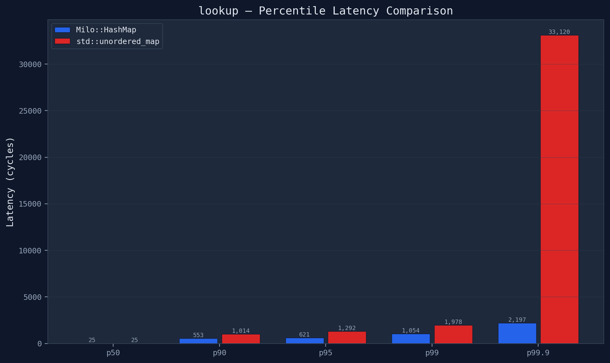
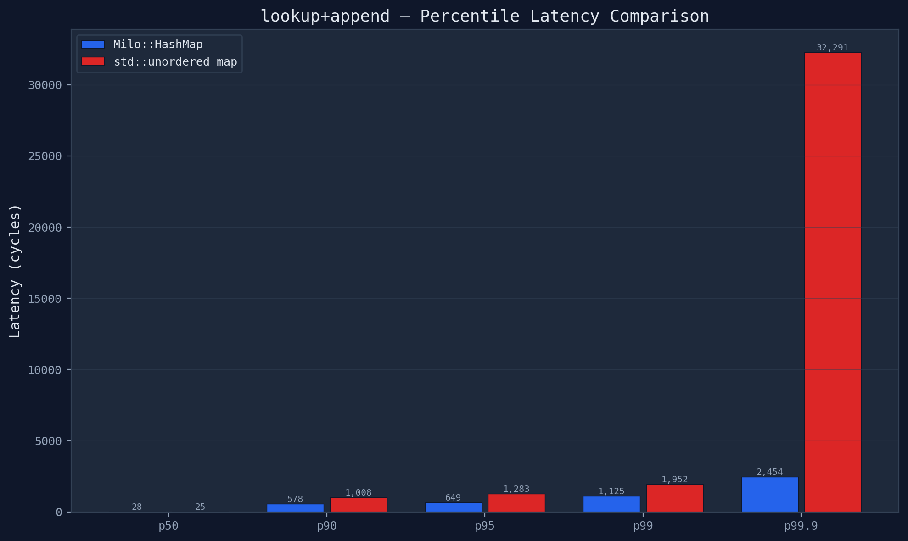
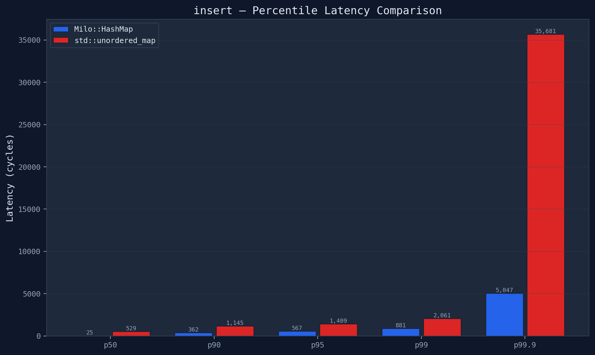
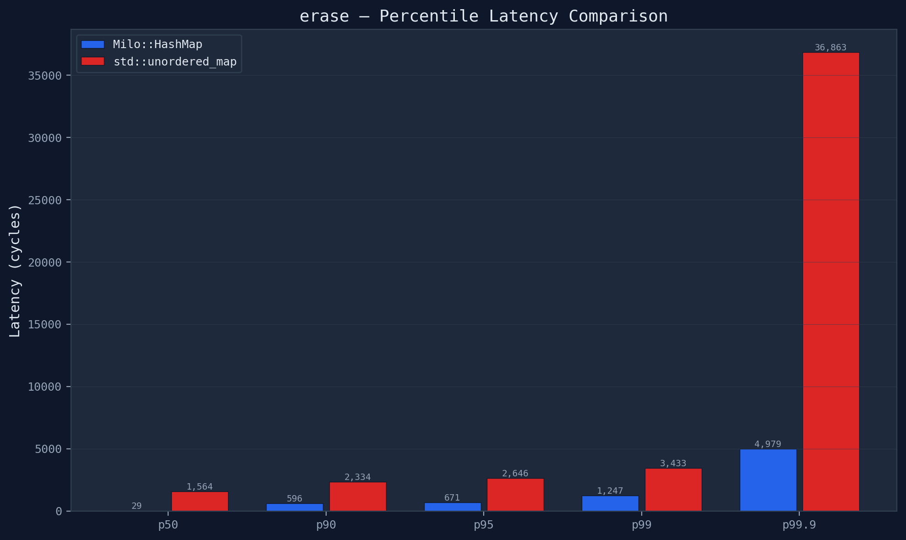

## milo::FlatMap
A deterministic, open‑addressed hash map for low‑latency C++ systems, designed to provide a smoother latency distribution through p99.

`milo::FlatMap` was designed to allow me to sketch systems quickly with verbose access to resources while not introducing wild tail latencies.

While `std::unordered_map` is great for general-purpose computing, it suffers from poor latency distribution where >p90 results are orders of magnitude slower than the mean, and insert/erase operations are very expensive.
std::unordered_map is typically a "bucket-of-linked-lists" (chaining) design, where each insertion can trigger a separate heap allocation for a new node. `milo::FlatMap` uses Open Addressing, where data lives in a single, contiguous array.

In std::unordered_map, Pointer/Iterator stability mandates in the C++ standard requires that once an element is inserted it's address must remain constant until that specific element is erased. Even if the map rehashes and grows to 1,000x its original size, the pointers to existing elements must remain valid. This leads to frequent cache misses and a fragmented memory layout. 

FlatMap is faster in-part because it entirely ignores this mandate.




How and Why?

FlatMap performs Linear Probing with prefetch and branch predictor hints over slot metadata stored contiguously in memory, seperate from key-value storage. This allows for much faster iteration over single-byte metadata that avoids processing the actual key:value data. 

modern CPU's are VERY good at pre-fetching linear arrays, and these clock cycles we save here allows for cheap re-addressing (shifting) on deletion of any element, ensuring our data stays packed tight in one linear memory space. 

In std::unordered_map or data structures with "tombstones" (marking a slot as deleted but not moving data), the map gets "polluted" over time. Lookups have to jump over these dead slots, making the search take longer, and forcing data packed into buckets to be evaluated before the next bucket can be looked at. Almost every lookup will have cache misses.


## Key Features

* **No per‑element heap allocations:** Memory is allocated in bulk up front.

* **Excellent cache locality:** Avoids pointer chasing and utilizes a separated metadata array. A probe loop touches only a dense byte array, checking 64 slots per cache miss.
  
* **Deterministic Deletions:** Uses backward-shift deletion instead of tombstones. Erasing is O(1) amortized.
 
* **Tightly bounded operation times:** Designed specifically for high-frequency environments where microsecond spikes are unacceptable.


## Why Determinism Matters Beyond Speed

When attempting to build high-frequency trading (HFT) systems, microseconds can be the difference between a won or lost trade. We need to be absolutely sure we are not missing opportunities due to structural flaws in our own containers.

* **Smarter Provisioning:** Provision your resources based on the mean latency plus a small safety margin, rather than massively over‑provisioning just to absorb p99.9 spikes.
* **Better Debuggability:** Performance anomalies and systemic issues are no longer hidden inside the natural variance of your data structures.


**Why Determinism Matters Beyond Speed**

  When attempting to build high-frequency trading or latency sensitive systems, microseconds can be the difference between a won or lost trade.
  The first step is that we need to be absolutely sure we are not missing opportunities due to structural flaws in our own containers.
    
  'milo::FlatMap' is intended to **help** with these issues. It cannot solve them. 
  
  *DISCLAIMER* I feel it important to note that any hash based map is likely **not** the right tool for RTOS/embedded or Low latency production environments.

  ## Usage
  
For string keys, `milo::char32` is recommended. It is a thin wrapper over `char[32]`. Because `milo::FlatMap` stores data contiguously,
pairing it with a 32-byte value struct aligns perfectly with standard 64-byte cache lines.

'milo::char32' contains a string literal constructor, so standard milo::FlatMap["StringKey"].item() calls will work.

For example:

```C++

  struct alignas(32) Position{
      bool open = false;
      float pnl = 0.0;
    
      void flatten(){ ; // flatten everything } 
  };
    
  // char[32] = 32 bytes, Position = 32 bytes 
  milo::FlatMap<milo::char32,std::vector<Position>> open_positions;

  // Because data is stored contiguously, a 'Flatten All' operation 
  // is a highly cache-friendly linear sweep.
      
  if(CATASTROPHIC_NEWS_EVENT){
    for (auto& position : open_positions["NVDA"]) {
        position.flatten();
    }  
  }
  
  // This closes EVERY position in the map. Highlighting the benefits of backward-shift deletion over stale tombstone entries.
  for (auto& [ticker, position] : open_positions) {
      position.close(); 
  }

  
```


